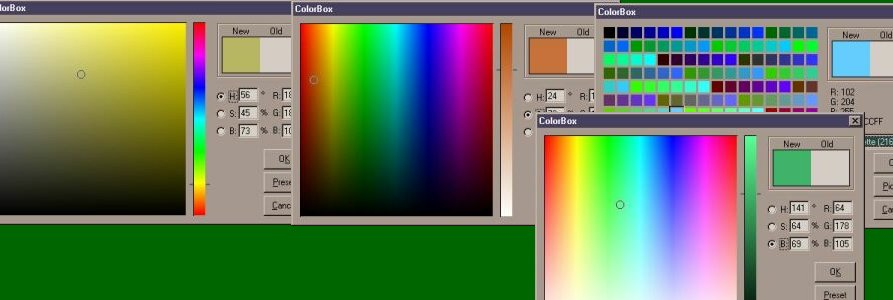



## ColorPicker that resembles Adobe Style ColorPicker \( with New ColorChangeEvent\)Update 24\-Feb\-02

### Description

ColorPicker that Resembles Adobe PhotoShop ColorPicker. Replace Windows Old Color Dialog with this new Standard ColorPicker (ColorBox) in your application With More Controll over the ColorPicker. This was firstly written as reusable form, but here I'm presenting it as an Active-X Control so that any one can use it easily. Algorithms are fast and was written from scratch. I have tried as much as possible to make this Controll Bug free. Any suggestions, comments expecially Votes will appreciated.

With New ColorChange Event which returns selected color Dynamically. small (Bug..? )Fixed.
 
### More Info
 

             |
---                |---
**Submitted On**   |2002-02-24 19:15:32
**By**             |[Saifudheen A A](https://github.com/Planet-Source-Code/PSCIndex/blob/master/ByAuthor/saifudheen-a-a.md)
**Level**          |Beginner
**User Rating**    |4.8 (254 globes from 53 users)
**Compatibility**  |VB 4\.0 \(32\-bit\), VB 5\.0, VB 6\.0
**Category**       |[OLE/ COM/ DCOM/ Active\-X](https://github.com/Planet-Source-Code/PSCIndex/blob/master/ByCategory/ole-com-dcom-active-x__1-29.md)
**World**          |[Visual Basic](https://github.com/Planet-Source-Code/PSCIndex/blob/master/ByWorld/visual-basic.md)
**Archive File**   |[ColorPicke572312242002\.zip](https://github.com/Planet-Source-Code/saifudheen-a-a-colorpicker-that-resembles-adobe-style-colorpicker-with-new-colorchangeeven__1-31402/archive/master.zip)

